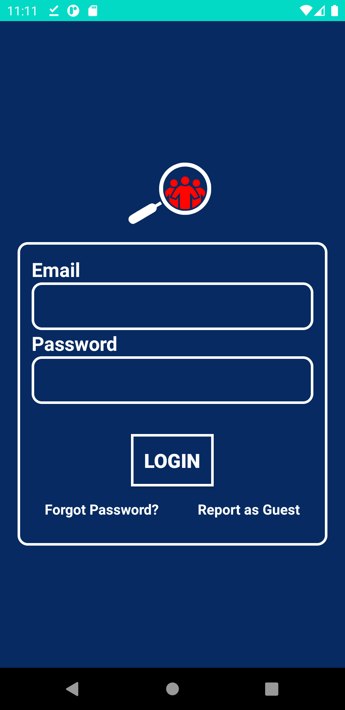
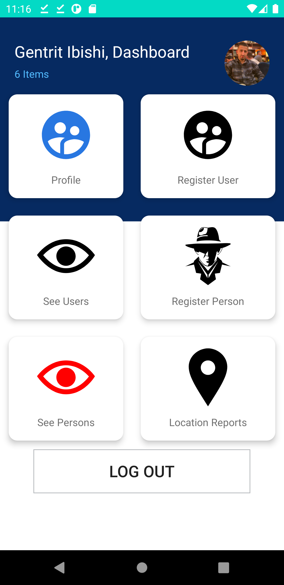
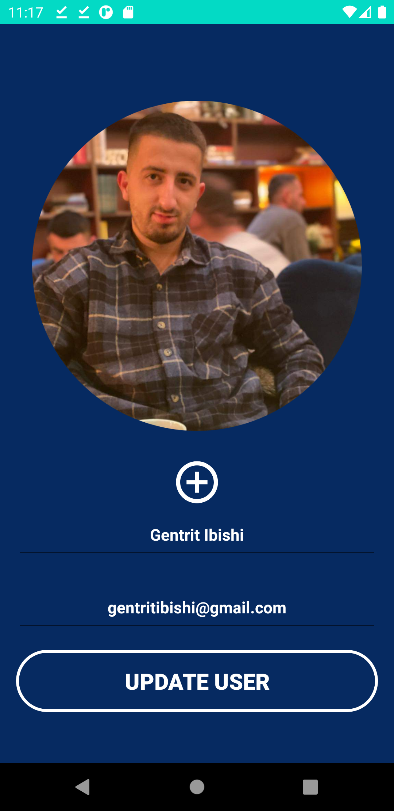
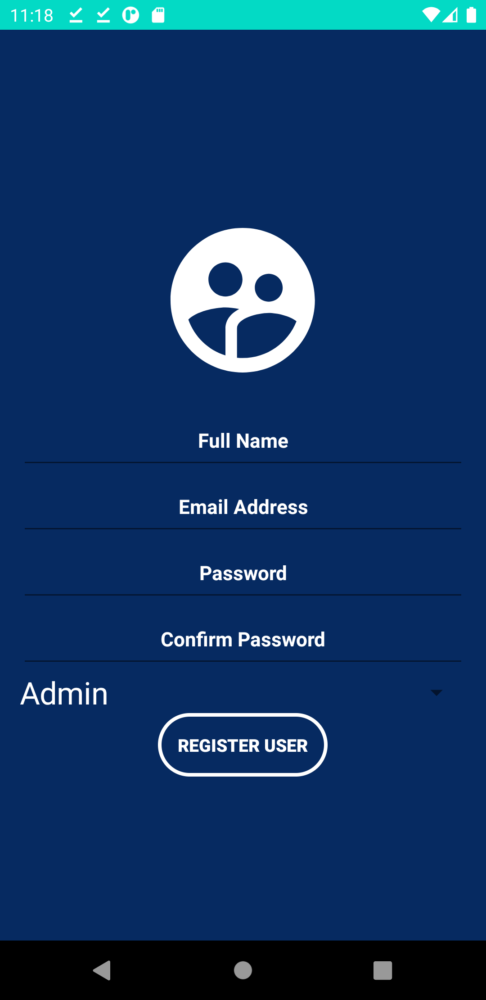
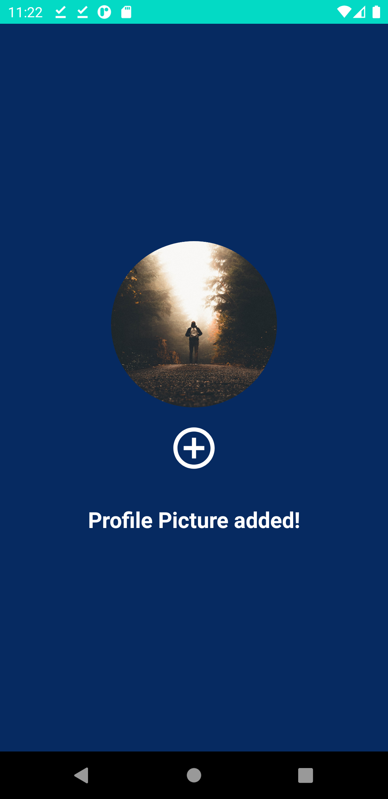
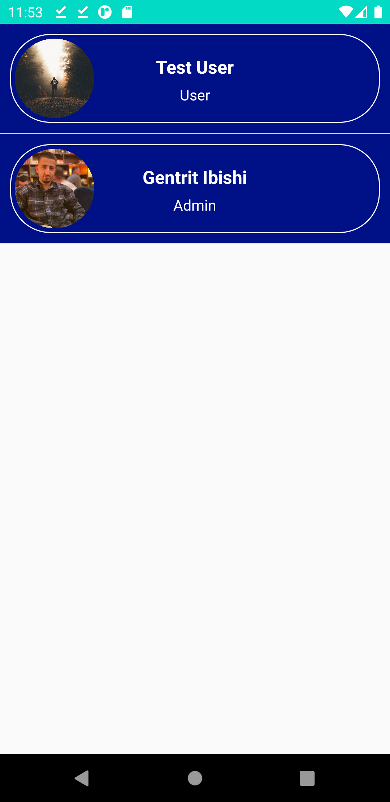
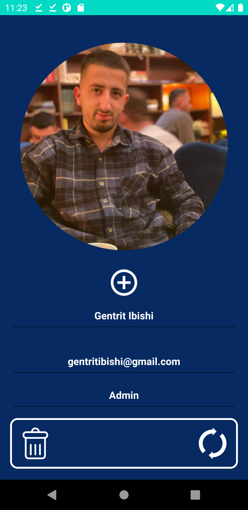
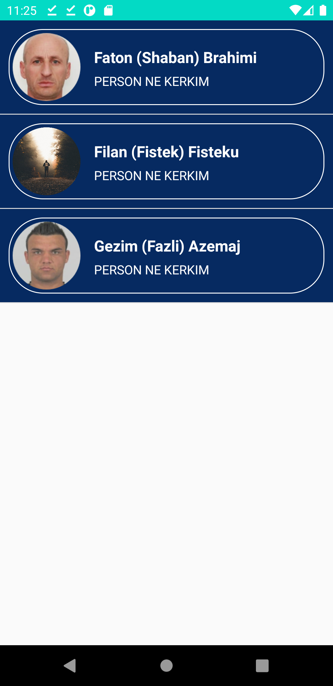
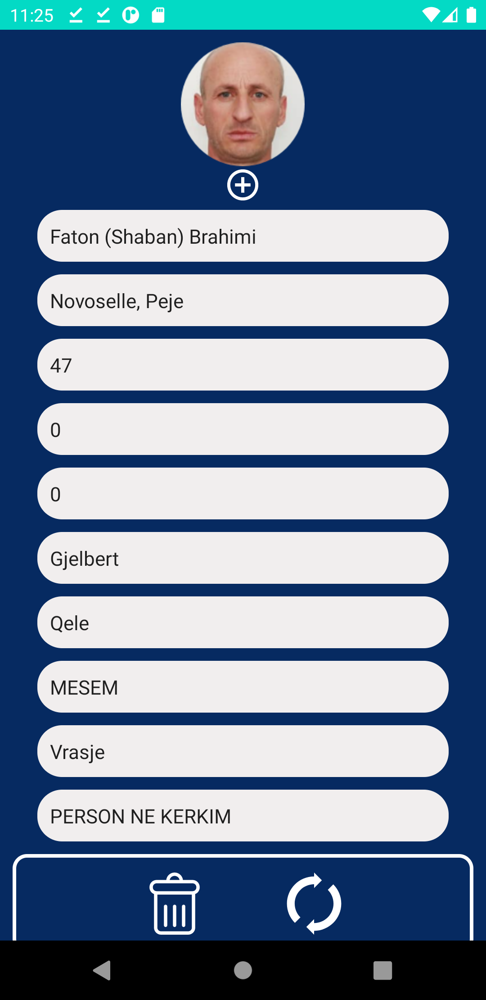
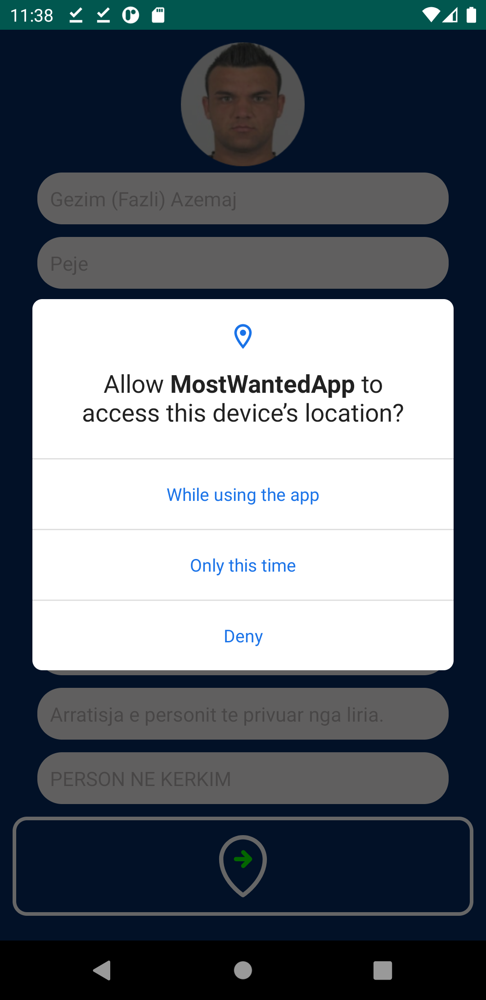

# MostWanted App

#### Shqip

#### MostWanted App është një aplikacion android, i cili është krijuar për të ndihmuar në gjetjen e personave të kërkuar nga "Policia e Kosovës" për kryerjen e veprave penale.

#### Pra aplikacioni është i thjesht në perdorim pasi që njerëzit po thuajse shumicen e kohës janë aktivë ne rrjetin social "Facebook" ku fanpage zyrtar i policisë kosoves qdo ditë publikon foto të përsonave të kërkuar dhe që qytetarët e kosovës të mund ndihmojnë në gjetjen e atyre personave pra me një button "Dergo Lokacionin" e merr lokacionin ku është qytetari e ruan në databasen firestore duke ja marr latitude dhe longitude të lokacionin të raportuar nga qytetari.

#### English

#### MostWanted App is an android application, which was created to help find persons wanted by the "Kosovo Police" for committing criminal offenses.

#### So the application is simple to use as people almost most of the time are active in the social network "Facebook" where the official fanpage of the Kosovo police every day publishes photos of wanted persons and that the citizens of Kosovo can help find those people so with a button "Send Location" takes the location where the citizen is stored in the firestore database taking the latitude and longitude of the location reported by the citizen.

# Zhvilluar nga / Developed By

#### Gentrit Ibishi - gentritibishi@gmail.com
#### Mirsad Dibrani - mirsad.dibrani@hotmail.com

# Mentor

#### Msc. Arbnor Halili

# E ndërtuar me / Built With

#### OOP(Java), Models, Material Design, ListView, PageAdapter, CardView, Animations, Spinner, SessionManagement, SharedPreferences

# Teknologjia e përdorur

#### Firebase -> Firestore Database, Authentication, Storage

* firebase-database:20.0.0

* firebase-firestore:23.0.1

* firebase-storage:20.0.0

* firebase-auth:21.0.1

#### Location Services

* play-services-location:16.0.0

#### Picasso

* picasso:2.71828

#### Espresso

* espresso-core:3.3.0

# Screenshots

